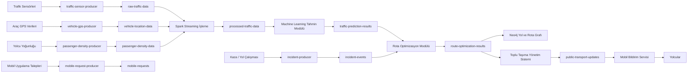

# Akıllı Ulaşım Sistemi - Proje Akışı

**Grup Adı:** Algoritma Aşıkları
**Proje Yöneticisi:** Yunus Çataltaş

## 📌 Proje Amacı ve Kapsamı
Bu proje, şehir içi ulaşımı optimize etmek için yapay zeka ve veri analizini kullanmayı amaçlar. Trafik yoğunluğunu tahmin ederek, toplu taşıma araçlarının rotalarını ve sefer saatlerini optimize eder. Amacımız, trafik sıkışıklığını azaltmak, yakıt tüketimini düşürmek ve yolcuların seyahat sürelerini kısaltmaktır.

## 🛠 Teknoloji Yığını
* **Programlama Dili:** Java
* **Büyük Veri & Akış:** Apache Spark, Apache Kafka
* **Veritabanı:** Neo4j
* **Yapay Zeka:** Machine Learning

---

## 📅 Haftalık İlerlemeler ve Yapılan Çalışmalar

### Hafta 1 (Görev Dağılımı ve Başlangıç)
* **Yunus Çataltaş:** Versiyon Kontrol Sistemi (Git) kurulumu yapıldı, merkezi repository oluşturuldu ve takım üyelerine yetki verildi. `projeakisi.md` dosyası hocanın talimatlarına göre oluşturuldu.
* **Şule Nur Bayğut:** Proje Analizi ve Kapsam Tanımlama çalışmalarını tanımladı.
* **Uğur Metin Karabulut:** Gereksinim Toplama ve Belgeleme (Fonksiyonel ve fonksiyonel olmayan) için paydaş görüşmeleri planlandı.
* **Faik Dursun:** Teknoloji Araştırması ve Seçimi yapıldı, kullanılacak araçlar netleştirildi.
* **Ayham Nawaf Hammoud:** Geliştirme Ortamı Kurulumu ve IDE yapılandırması sağlandı.

*(Not: Her hafta ekip üyeleri kendi yaptıkları çalışmaları bu dosyadaki ilgili haftanın altına ekleyecektir.)*


# 📌 Projenin Genel Hedefleri ve Kapsamı

Projenin temel vizyonu, kentsel ulaşımı statik bir yapıdan çıkararak, anlık verilere duyarlı, proaktif ve karar-destek mekanizmalı bir ekosisteme dönüştürmektir.

## Stratejik Hedefler

**Operasyonel Verimlilik:** Mevcut ulaşım altyapısını en yüksek kapasitede kullanarak seyahat sürelerinde ortalama %18,7 oranında iyileşme sağlamak.

**Sürdürülebilirlik:** Gereksiz rölanti sürelerini ve verimsiz rotaları engelleyerek yakıt tüketiminde %10-30, karbon emisyonlarında ise %15'e varan net azalma elde etmek.

**Ulaşım Teşviki:** Toplu taşımayı daha öngörülebilir ve konforlu hale getirerek şahsi araç kullanımını minimize etmek.

## Proje Kapsamı

Proje; şehir genelindeki veri kaynaklarından beslenen bir izleme merkezi, trafik ışıklarını ve araç rotalarını yöneten bir optimizasyon motoru, toplu taşıma operasyonlarını dinamikleştiren bir yönetim sistemi ve vatandaşların kullanımına sunulacak entegre bir mobil platformun geliştirilmesini kapsamaktadır.


  
# ⚠️ Çözülecek Temel Sorunlar

Sistem, modern kent yaşamını zorlaştıran şu kronik sorunlara doğrudan müdahale etmektedir

**Öngörülemeyen Trafik Sıkışıklığı:** Trafiğin sadece o anki durumunun bilinmesi, ancak geçmiş tecrübeler ve anlık olaylar ışığında 15-30 dakika sonrasının tahmin edilememesi sonucu oluşan ani tıkanıklıklar.

**Verimsiz ve Statik Sefer Planları:** Yolcu talebiyle örtüşmeyen sabit hatlar ve saatler nedeniyle araçların düşük kapasiteyle çalışması, buna karşın bazı bölgelerde yolcu yığılmalarının yaşanması.

**Bilgi Dağınıklığı:** Farklı ulaşım modları (otobüs, metro, scooter vb.) arasındaki koordinasyon eksikliği nedeniyle yolcuların kesintisiz bir seyahat planı oluşturamaması.

**Acil Durum Gecikmeleri:** Trafik yoğunluğu nedeniyle ambulans, itfaiye gibi acil müdahale araçlarının olay yerine ulaşım sürelerinin kritik seviyelere çıkması.


# ⚙️ Sistemin İşlevsel Özellikleri ve Modüller

## A. Trafik İzleme ve Anlık Analiz Sistemi

**Gerçek Zamanlı Takip:** Şehrin stratejik noktalarındaki sensörlerden gelen hız ve konum verilerini işleyerek trafik yoğunluğunu anlık olarak haritalandırır.

**Anomali Tespiti:** Kaza veya arıza gibi olağandışı durumları anında fark ederek operatörlere uyarı gönderir ve trafik akışını otomatik olarak yeniden yönlendirir.

## B. Akıllı Rota ve Kavşak Optimizasyonu

**Gelecek Tahminleme:** Geçmiş veri modellerini kullanarak trafiğin tıkanma olasılığı olan bölgeleri önceden belirler ve yoğunluğu henüz oluşmadan dağıtır.

**Dinamik Sinyalizasyon:** Trafik ışıklarının sürelerini araç yoğunluğuna göre anlık olarak ayarlar; kavşaklardaki bekleme sürelerini %28'e kadar azaltır.

**Acil Durum Önceliği (Yeşil Dalga):** Acil durum araçlarının güzergahındaki ışıkları otomatik olarak yeşile çevirerek duraksız geçiş imkanı sağlar.

## C. Yeni Nesil Toplu Taşıma Yönetimi

**Talep Odaklı Ulaşım (DRT):** Sabit hatların verimsiz olduğu bölgelerde, yolcuların uygulama üzerinden yaptığı çağrılara göre rotasını belirleyen esnek servis imkanı sunar.

**Dinamik Çizelgeleme:** Otobüs sefer saatlerini yolcu yoğunluğuna ve trafik durumuna göre saniyeler içinde güncelleyerek duraklardaki beklemeleri en aza indirir.

**Yolcu Yoğunluk Analizi:** Kameralar üzerinden duraklardaki kalabalığı ölçer; yığılma tespit edildiğinde sisteme otomatik olarak ek sefer tanımlar.

## D. Entegre Mobil Kullanıcı Platformu

**Tek Pencereden Ulaşım (MaaS):** Scooter, bisiklet, otobüs ve metroyu tek bir uygulamada birleştirerek yolculuk planlama ve ödeme kolaylığı sağlar.

**Canlı Bilgilendirme:** Araçların harita üzerindeki anlık konumlarını, durağa kesin varış sürelerini ve ağdaki aksamaları saniye hassasiyetinde yolculara iletir.


# 📊 Beklenen Somut Kazanımlar

**Zaman Kazancı:** Toplam seyahat sürelerinde seyahat başına ortalama %18 iyileşme.

**Ekonomik Tasarruf:** Optimize edilen rotalar sayesinde yakıt harcamalarında %30'a varan düşüş.

**Çevresel Katkı:** Karbon salımının azaltılmasıyla daha yaşanabilir bir şehir atmosferi.

Gereksinim Analizi Dokümanı
1. Proje Tanımı
Akıllı Ulaşım Sistemi projesi, şehir içi ulaşımı daha verimli hale getirmek amacıyla yapay zeka, büyük veri analizi ve optimizasyon tekniklerini kullanmayı hedeflemektedir. Sistem; trafik yoğunluğunu tahmin edecek, toplu taşıma araçlarının rota ve sefer planlarını optimize edecek, yolculara mobil uygulama üzerinden bilgilendirme sağlayacaktır. Böylece trafik sıkışıklığının azaltılması, yakıt tüketiminin düşürülmesi ve seyahat sürelerinin kısaltılması amaçlanmaktadır.
2. Amaç
Bu gereksinim analizi çalışmasının amacı, proje paydaşlarıyla yapılan görüşmeler doğrultusunda sistemin ihtiyaçlarını belirlemek ve bu ihtiyaçları fonksiyonel gereksinimler ile fonksiyonel olmayan gereksinimler şeklinde sistematik olarak belgelemektir.
3. Paydaş Analizi
Projede görüşülmesi gereken temel paydaşlar şunlardır:
3.1 Belediye / Ulaşım Daire Başkanlığı
Şehir içi ulaşım politikalarını belirler.
Trafik ve toplu taşıma verilerinin kullanımına onay verir.
Sistemin şehir geneline entegrasyonundan sorumludur.
3.2 Toplu Taşıma İşletmeleri
Otobüs, minibüs, tramvay gibi araçların operasyonunu yürütür.
Araç konumları, sefer planları ve doluluk oranları gibi verileri sağlar.
Sistemden rota ve sefer optimizasyon önerileri bekler.
3.3 Trafik Yönetim Merkezi
Anlık trafik yoğunluğu, yol çalışmaları, kazalar ve kapanan yollar gibi bilgileri sisteme sağlar.
Trafik tahmin modülünden faydalanır.
3.4 Yolcular / Vatandaşlar
Mobil uygulama üzerinden sefer saatleri, gecikmeler, yoğunluk ve alternatif rotalar hakkında bilgi alır.
Kullanıcı deneyimi açısından sistemin en önemli son kullanıcı grubudur.
3.5 Sistem Yöneticileri
Tüm sistemin izlenmesi, yönetimi ve raporlanmasından sorumludur.
Kullanıcı yönetimi, sistem performansı ve veri akışını kontrol eder.
3.6 Yazılım Geliştirme Ekibi
Sistem bileşenlerini geliştirir, test eder ve bakımını sağlar.
Gereksinimlerin teknik çözümlere dönüştürülmesinden sorumludur.
4. Gereksinim Toplama Yöntemi
Proje gereksinimleri aşağıdaki yöntemlerle toplanmıştır:
Paydaş görüşmeleri
Senaryo analizi
Kullanıcı ihtiyaçlarının incelenmesi
Mevcut ulaşım sistemlerinin gözlemlenmesi
Teknik altyapı ve veri kaynaklarının değerlendirilmesi
Bu süreçte özellikle şu sorulara yanıt aranmıştır:
Trafik verileri hangi kaynaklardan alınacaktır?
Sistem hangi kullanıcı gruplarına hizmet verecektir?
Rotayı optimize ederken hangi kriterler dikkate alınacaktır?
Kullanıcılar mobil uygulamada hangi bilgilere erişmek isteyecektir?
Sistem hangi performans ve güvenlik standartlarını sağlamalıdır?
5. Fonksiyonel Gereksinimler
Fonksiyonel gereksinimler, sistemin yerine getirmesi gereken işlevleri tanımlar.
5.1 Trafik Veri Toplama Modülü
FR-1: Sistem, trafik verilerini farklı kaynaklardan toplayabilmelidir.
Açıklama: Kamera sistemleri, sensörler, GPS cihazları, toplu taşıma araçları ve açık veri kaynakları üzerinden veri alınmalıdır.
FR-2: Sistem, anlık trafik yoğunluğu verisini işleyebilmelidir.
Açıklama: Belirli yol, kavşak ve güzergâhlardaki yoğunluk bilgisi gerçek zamanlı olarak analiz edilmelidir.
FR-3: Sistem, geçmiş trafik verilerini depolayabilmelidir.
Açıklama: Trafik tahmini ve analiz süreçlerinde kullanılmak üzere tarihsel veriler saklanmalıdır.
FR-4: Sistem, veri akışındaki eksik veya hatalı kayıtları tespit edebilmelidir.
Açıklama: Yanlış, eksik veya tutarsız veriler sistem tarafından filtrelenmelidir.
5.2 Trafik Tahmin ve Analiz Modülü
FR-5: Sistem, geçmiş ve anlık verilere dayanarak trafik yoğunluğunu tahmin edebilmelidir.
Açıklama: Makine öğrenmesi algoritmaları ile belirli zaman dilimleri için yoğunluk tahmini yapılmalıdır.
FR-6: Sistem, yoğunluk artışı beklenen bölgeleri önceden belirleyebilmelidir.
Açıklama: Özellikle işe gidiş-geliş saatleri, etkinlik günleri ve hava koşullarına bağlı yoğunluklar öngörülmelidir.
FR-7: Sistem, trafik yoğunluk raporları oluşturabilmelidir.
Açıklama: Günlük, haftalık ve aylık raporlar üretilebilmelidir.
5.3 Rota Optimizasyon Modülü
FR-8: Sistem, toplu taşıma araçları için en uygun rotaları önerebilmelidir.
Açıklama: Trafik yoğunluğu, mesafe, yol durumu ve yolcu talebi dikkate alınmalıdır.
FR-9: Sistem, alternatif güzergâhlar oluşturabilmelidir.
Açıklama: Yol kapanması, kaza veya aşırı yoğunluk durumlarında sistem alternatif rota üretmelidir.
FR-10: Sistem, sefer saatlerini optimize edebilmelidir.
Açıklama: Yoğun saatlerde sefer sıklığı artırılmalı, düşük yoğunlukta optimize edilmiş planlama yapılmalıdır.
FR-11: Sistem, rota değişikliklerini ilgili yöneticilere bildirebilmelidir.
Açıklama: Operasyon birimi önerilen rota güncellemelerini görüntüleyebilmelidir.
5.4 Toplu Taşıma Yönetim Sistemi
FR-12: Sistem, araçların anlık konumunu takip edebilmelidir.
Açıklama: Her aracın lokasyonu merkezi panelde gösterilmelidir.
FR-13: Sistem, araç doluluk oranını izleyebilmelidir.
Açıklama: Yolcu yoğunluğu analiz edilerek kapasite yönetimi sağlanmalıdır.
FR-14: Sistem, sefer gecikmelerini tespit edebilmelidir.
Açıklama: Planlanan saat ile gerçekleşen saat karşılaştırılarak gecikmeler raporlanmalıdır.
FR-15: Sistem, yöneticilere karar destek ekranı sunmalıdır.
Açıklama: Yoğun bölgeler, aktif araçlar, gecikmeler ve önerilen müdahaleler tek panelde gösterilmelidir.
5.5 Mobil Uygulama
FR-16: Kullanıcılar, mobil uygulama üzerinden sefer saatlerini görüntüleyebilmelidir.
FR-17: Kullanıcılar, araçların tahmini varış süresini görebilmelidir.
FR-18: Kullanıcılar, trafik yoğunluğu nedeniyle oluşan gecikmeler hakkında bildirim alabilmelidir.
FR-19: Kullanıcılar, kendileri için önerilen alternatif güzergâhları görüntüleyebilmelidir.
FR-20: Kullanıcılar, sık kullandıkları durak ve hatları favorilere ekleyebilmelidir.
FR-21: Mobil uygulama, anlık bildirim gönderebilmelidir.
Açıklama: Sefer iptali, gecikme, rota değişikliği gibi durumlarda kullanıcılara bildirim gönderilmelidir.
5.6 Yönetim ve Yetkilendirme
FR-22: Sistem, farklı kullanıcı rolleri tanımlayabilmelidir.
Açıklama: Yönetici, operatör, analist ve son kullanıcı gibi roller desteklenmelidir.
FR-23: Yetkili kullanıcılar sisteme güvenli giriş yapabilmelidir.
FR-24: Yönetici kullanıcılar raporları görüntüleyip dışa aktarabilmelidir.
FR-25: Sistem yöneticisi, kullanıcı ve yetki yönetimi yapabilmelidir.
6. Fonksiyonel Olmayan Gereksinimler
Fonksiyonel olmayan gereksinimler, sistemin kalite özelliklerini ve çalışma koşullarını ifade eder.
6.1 Performans Gereksinimleri
NFR-1: Sistem, anlık trafik verilerini düşük gecikmeyle işleyebilmelidir.
Ölçüt: Gerçek zamanlı veri işleme gecikmesi mümkün olduğunca birkaç saniye seviyesinde olmalıdır.
NFR-2: Mobil uygulamada kullanıcı sorgularına hızlı yanıt verilmelidir.
Ölçüt: Ortalama ekran yanıt süresi kabul edilebilir düzeyde tutulmalıdır.
NFR-3: Sistem, yüksek veri hacmini kaldırabilecek yapıda olmalıdır.
Ölçüt: Büyük şehir ölçeğinde eşzamanlı veri akışı desteklenmelidir.
6.2 Güvenilirlik Gereksinimleri
NFR-4: Sistem, 7/24 çalışabilecek şekilde tasarlanmalıdır.
NFR-5: Veri kaybını önlemek için yedekleme mekanizması bulunmalıdır.
NFR-6: Hata durumlarında sistem kontrollü şekilde çalışmaya devam edebilmelidir.
Açıklama: Bir modülde hata oluşsa bile tüm sistem tamamen devre dışı kalmamalıdır.
6.3 Güvenlik Gereksinimleri
NFR-7: Kullanıcı verileri güvenli şekilde saklanmalıdır.
NFR-8: Yetkisiz erişim engellenmelidir.
NFR-9: Veri iletimi sırasında güvenli iletişim protokolleri kullanılmalıdır.
Açıklama: API ve uygulama haberleşmesinde şifreli iletişim tercih edilmelidir.
NFR-10: Yönetici paneline erişim güçlü kimlik doğrulama ile korunmalıdır.
6.4 Ölçeklenebilirlik Gereksinimleri
NFR-11: Sistem, artan kullanıcı ve veri sayısına göre ölçeklenebilir olmalıdır.
NFR-12: Yeni veri kaynakları sisteme kolayca entegre edilebilmelidir.
NFR-13: Farklı şehirler için uyarlanabilir altyapı sunmalıdır.
6.5 Kullanılabilirlik Gereksinimleri
NFR-14: Mobil uygulama sade ve kullanıcı dostu bir arayüze sahip olmalıdır.
NFR-15: Yönetim paneli kolay öğrenilebilir ve anlaşılır olmalıdır.
NFR-16: Sistem, farklı yaş ve teknoloji kullanım düzeyindeki kullanıcılar tarafından rahatça kullanılabilmelidir.
6.6 Bakım ve Sürdürülebilirlik Gereksinimleri
NFR-17: Sistem modüler mimaride geliştirilmelidir.
NFR-18: Kod yapısı bakım ve güncelleme için uygun olmalıdır.
NFR-19: Sistem loglama ve hata izleme mekanizmalarına sahip olmalıdır.
NFR-20: Yeni yapay zeka modelleri sisteme sonradan entegre edilebilmelidir.
7. Varsayımlar ve Kısıtlar
7.1 Varsayımlar
Trafik verilerine erişim için ilgili kurumlardan izin alınacağı varsayılmıştır.
Toplu taşıma araçlarında GPS benzeri takip altyapısının bulunduğu kabul edilmiştir.
Kullanıcıların mobil internet erişimine sahip olduğu varsayılmıştır.
7.2 Kısıtlar
Veri kalitesi, sistem doğruluğunu doğrudan etkileyecektir.
Şehir altyapısındaki teknik eksiklikler gerçek zamanlı veri akışını zorlaştırabilir.
Projede kullanılacak teknolojiler Java, Spark, Kafka, Neo4j ve makine öğrenmesi araçlarıyla sınırlıdır.
Kamu kurumlarıyla entegrasyon süreçleri zaman alabilir.
8. Örnek Paydaş Görüşme Soruları
Aşağıdaki sorular gereksinim toplama sürecinde kullanılabilir:
Belediye / Ulaşım Yetkilileri için
Mevcut ulaşım sisteminde en büyük problem nedir?
Trafik yoğunluğu en çok hangi bölgelerde ve saatlerde yaşanmaktadır?
Hangi veriler sisteme entegre edilebilir?
Sistemin başarısını hangi kriterlerle değerlendireceksiniz?
Toplu Taşıma İşletmeleri için
Araç rotaları ne sıklıkla değiştirilmektedir?
En çok gecikme yaşanan hatlar hangileridir?
Araç doluluk bilgileri mevcut mu?
Sistemden hangi operasyonel önerileri bekliyorsunuz?
Yolcular için
Ulaşımda en çok hangi sorunları yaşıyorsunuz?
Mobil uygulamada hangi bilgileri görmek istersiniz?
Gecikme ve rota değişikliklerinde bildirim almak ister misiniz?
Alternatif rota önerileri sizin için ne kadar önemlidir?
Sistem Yöneticileri için
Hangi raporlar kritik öneme sahiptir?
Yetkilendirme seviyeleri nasıl olmalıdır?
Sistemde hangi alarmlar ve uyarılar bulunmalıdır?
9. Sonuç
Yapılan gereksinim analizi sonucunda Akıllı Ulaşım Sistemi’nin, çok paydaşlı ve veri yoğun çalışan bir karar destek sistemi olduğu anlaşılmıştır. Projenin başarısı; doğru veri toplama, gerçek zamanlı analiz, etkili rota optimizasyonu ve kullanıcı dostu bilgilendirme mekanizmalarına bağlıdır. Belirlenen fonksiyonel ve fonksiyonel olmayan gereksinimler, sistem tasarımı ve geliştirme aşamalarına temel oluşturacaktır.


Akıllı Ulaşım Sistemi İçin Algoritma Performans Analizi Raporu
1. Giriş
Akıllı Ulaşım Sistemi projesinde geliştirilen algoritmaların temel amacı, şehir içi ulaşımı daha düzenli, hızlı ve verimli hale getirmektir. Bu projede özellikle trafik yoğunluğunu tahmin etme, rota optimizasyonu, sefer saatlerini düzenleme ve yolcu bilgilendirme gibi alanlarda algoritmalardan yararlanılmaktadır.
Bu raporda geliştirilen algoritmaların performansı analiz edilmiş, hangi ölçütlere göre değerlendirileceği açıklanmış ve sistemin daha iyi çalışabilmesi için iyileştirme önerileri sunulmuştur.
2. Analizi Yapılan Algoritmalar
Bu proje kapsamında değerlendirilebilecek başlıca algoritmalar şunlardır:
2.1 Trafik Yoğunluğu Tahmin Algoritması
Bu algoritma, geçmiş trafik verileri ve anlık verileri kullanarak belirli bölgelerde oluşabilecek trafik yoğunluğunu tahmin eder.
2.2 Rota Optimizasyon Algoritması
Bu algoritma, araçların gideceği güzergahları trafik durumuna, mesafeye ve yolcu yoğunluğuna göre en uygun şekilde belirler.
2.3 Sefer Planlama Algoritması
Bu algoritma, hangi saatlerde kaç araç çalışması gerektiğini hesaplayarak sefer sıklığını düzenler.
2.4 Yolcu Bilgilendirme Algoritması
Bu algoritma, araçların tahmini varış süresini hesaplayarak yolculara doğru bilgi verilmesini sağlar.
3. Performans Analizinde Kullanılan Metrikler
Algoritmaların başarısını değerlendirmek için bazı performans metrikleri kullanılır.
3.1 Doğruluk Oranı
Özellikle trafik tahmin algoritmasında önemlidir. Algoritmanın yaptığı tahminlerin gerçek verilerle ne kadar uyuştuğunu gösterir.
Örnek:
Eğer sistem yoğun trafik olacağını söylemişse ve gerçekten yoğun trafik yaşanmışsa, doğruluk oranı yüksek kabul edilir.
3.2 Hata Oranı
Algoritmanın ne kadar yanlış tahmin yaptığını gösterir. Hata oranı ne kadar düşükse sistem o kadar başarılıdır.
3.3 Yanıt Süresi
Sistemin veriyi işleyip sonuç üretme hızıdır. Özellikle anlık araç takibi ve yolcu bilgilendirme için çok önemlidir.
3.4 Kaynak Kullanımı
Algoritmanın çalışırken ne kadar işlemci, bellek ve ağ kaynağı kullandığını gösterir. Çok fazla kaynak tüketen sistemler maliyetli olabilir.
3.5 Ölçeklenebilirlik
Sistem kullanıcı sayısı arttığında veya veri miktarı büyüdüğünde performansını koruyabiliyor mu, buna bakılır.
3.6 Tahmini Varış Süresi Başarımı
Araçların durağa ulaşma süresini ne kadar doğru hesapladığı ölçülür. Yolcular için en önemli metriklerden biridir.
4. Algoritmaların Performans Değerlendirmesi
4.1 Trafik Yoğunluğu Tahmin Algoritması
Bu algoritma, sistemin önemli parçalarından biridir çünkü rota düzenleme ve sefer planlama buna göre yapılmaktadır. Eğer trafik tahmini doğru olursa sistem daha etkili çalışır.
Güçlü Yönleri
Geçmiş veriler kullanıldığı için yoğun saatler daha kolay tahmin edilebilir.
Trafik yoğunluğunu önceden tahmin ederek rota değişiklikleri yapılabilir.
Yönetici paneline karar desteği sağlar.
Zayıf Yönleri
Sadece geçmiş verilere bağlı kalırsa ani kazaları veya beklenmedik yoğunlukları tahmin etmekte zorlanabilir.
Veri eksikliği varsa doğruluk düşebilir.
Gerçek zamanlı veri azsa sonuçlar güncelliğini kaybedebilir.
Performans Değerlendirmesi
Bu algoritmanın doğruluk oranı yüksek olduğunda sistem genel olarak daha verimli çalışacaktır. Ancak gerçek zamanlı veriyle desteklenmezse hata oranı artabilir.
4.2 Rota Optimizasyon Algoritması
Bu algoritma, araçların en uygun yoldan ilerlemesini sağlar. Burada amaç hem zamanı hem de yakıt tüketimini azaltmaktır.
Güçlü Yönleri
Trafik durumuna göre daha kısa veya daha hızlı rota seçebilir.
Yakıt tasarrufu sağlayabilir.
Yolculuk süresini azaltabilir.
Zayıf Yönleri
Çok fazla değişken olduğunda hesaplama süresi uzayabilir.
Anlık trafik değişikliklerinde sürekli yeniden hesaplama gerekebilir.
Yol durumu verileri eksikse en iyi sonuç alınamayabilir.
Performans Değerlendirmesi
Bu algoritma başarılı olduğunda hem araç yönetimi hem de yolcu memnuniyeti artar. Ancak büyük veriyle çalışırken işlem süresi dikkat edilmesi gereken önemli bir noktadır.
4.3 Sefer Planlama Algoritması
Bu algoritma, hangi saatlerde kaç aracın çalışacağını belirler. Özellikle sabah ve akşam yoğun saatlerde çok önemlidir.
Güçlü Yönleri
Yolcu yoğunluğuna göre ek sefer planlanabilir.
Araçların boş ya da aşırı dolu gitmesi azaltılabilir.
Kaynaklar daha verimli kullanılabilir.
Zayıf Yönleri
Talep yanlış tahmin edilirse gereksiz sefer veya yetersiz sefer sorunu yaşanabilir.
Sadece sabit kurallarla çalışırsa esnekliği düşük olur.
Özel günler, hava durumu ve etkinlikler hesaba katılmazsa hata artabilir.
Performans Değerlendirmesi
Sefer planlama algoritması, sistemin verimliliğini doğrudan etkiler. Doğru çalıştığında hem bekleme süresi azalır hem de araç kapasitesi daha iyi kullanılır.
4.4 Yolcu Bilgilendirme Algoritması
Bu algoritma, yolculara araçların tahmini geliş süresini ve gecikme bilgisini sunar.
Güçlü Yönleri
Yolcuların bekleme süresini daha iyi planlamasını sağlar.
Kullanıcı memnuniyetini artırır.
Mobil uygulama üzerinden anlık bilgi verilebilir.
Zayıf Yönleri
Konum verisi gecikmeli gelirse yanlış bilgi verebilir.
Tahmini varış süresi sık sık değişirse kullanıcı güveni azalabilir.
GPS hataları sonucu yanlış tahmin yapılabilir.
Performans Değerlendirmesi
Bu algoritmanın başarısı doğrudan kullanıcı deneyimini etkiler. Yolcuya doğru bilgi verilmesi sistemin güvenilirliğini artırır.
5. Genel Performans Sonuçları
Projede kullanılan algoritmalar genel olarak şehir içi ulaşımın iyileştirilmesine katkı sağlar. Özellikle trafik tahmini ve rota optimizasyonu doğru çalıştığında sistemin genel başarısı artmaktadır. Ancak performansın yüksek kalabilmesi için algoritmaların yalnızca teorik olarak değil, gerçek zamanlı verilerle de desteklenmesi gerekir.
Genel olarak bakıldığında:
Trafik tahmin algoritması sistemin karar verme başarısını etkiler.
Rota optimizasyon algoritması zaman ve maliyet açısından önemlidir.
Sefer planlama algoritması kaynak kullanımını düzenler.
Yolcu bilgilendirme algoritması kullanıcı memnuniyetini artırır.
6. İyileştirme Önerileri
6.1 Gerçek Zamanlı Veri Kullanımını Artırma
Algoritmalar yalnızca geçmiş verilere değil, anlık trafik, hava durumu ve araç konumu gibi verilere de bağlı çalışmalıdır. Böylece sonuçlar daha doğru olur.
6.2 Makine Öğrenmesi Modellerini Güncelleme
Makine öğrenmesi kullanılan algoritmalar belirli aralıklarla yeniden eğitilmelidir. Çünkü trafik yapısı zamanla değişebilir.
6.3 Daha Fazla Veri Kaynağı Ekleme
Sistem; GPS, kamera, sensör, yolcu kart geçiş verileri ve hava durumu gibi farklı kaynaklardan veri alırsa tahmin başarısı artar.
6.4 Hesaplama Süresini Azaltma
Rota optimizasyonunda çok karmaşık hesaplamalar varsa algoritmalar sadeleştirilebilir veya paralel işlem teknikleri kullanılabilir. Bu noktada Spark teknolojisi faydalı olabilir.
6.5 Kullanıcı Geri Bildirimlerini Sisteme Dahil Etme
Yolcuların ve sürücülerin verdiği geri bildirimler analiz edilerek sistemin tahmin kalitesi artırılabilir.
6.6 Olağanüstü Durumlara Uyum Sağlama
Kaza, yol kapanması, hava koşulları veya etkinlik gibi beklenmeyen durumlarda algoritmalar hızlı şekilde yeni karar verebilmelidir.
6.7 Test ve Simülasyon Ortamı Oluşturma
Algoritmalar gerçek sisteme alınmadan önce farklı trafik senaryolarında test edilmelidir. Böylece zayıf yönler önceden görülebilir.
7. Sonuç
Akıllı Ulaşım Sistemi içinde geliştirilen algoritmalar, toplu taşımanın daha akıllı ve verimli çalışmasını sağlayan en önemli bileşenlerdir. Yapılan performans analizine göre algoritmaların başarılı olabilmesi için doğruluk, hız, kaynak kullanımı ve ölçeklenebilirlik gibi ölçütlerin dikkate alınması gerekmektedir.
Özellikle trafik tahmini, rota optimizasyonu, sefer planlama ve yolcu bilgilendirme algoritmaları sistemin temelini oluşturmaktadır. Bu algoritmaların gerçek zamanlı verilerle desteklenmesi, düzenli olarak güncellenmesi ve farklı senaryolarla test edilmesi sistem performansını önemli ölçüde artıracaktır.
Sonuç olarak, iyi analiz edilmiş ve sürekli geliştirilen algoritmalar sayesinde şehir içi ulaşım daha hızlı, daha güvenli ve daha verimli hale getirilebilir.

Toplu Taşıma Yönetim Sistemi (TTYS) Gereksinim Analizi
1. Giriş
Bu projede geliştirilecek olan Toplu Taşıma Yönetim Sistemi (TTYS), şehir içindeki ulaşımı daha düzenli ve verimli hale getirmeyi amaçlamaktadır. Sistem sayesinde otobüs, minibüs gibi toplu taşıma araçlarının rotaları, sefer saatleri ve konumları takip edilebilecektir.
Ayrıca yapay zeka ve veri analizi kullanılarak trafik yoğunluğuna göre daha iyi kararlar alınması hedeflenmektedir. Böylece hem yolcuların bekleme süresi azalacak hem de ulaşım daha hızlı ve düzenli olacaktır.
2. Sistem Amacı
Bu sistemin amacı:
Toplu taşıma araçlarının rotalarını daha verimli hale getirmek
Sefer saatlerini trafik durumuna göre düzenlemek
Araçların anlık konumlarını takip etmek
Yolculara doğru ve anlık bilgi vermek
Ulaşımı daha hızlı ve düzenli hale getirmek
3. Sistem Kapsamı
Bu sistemde şu özellikler olacaktır:
Rota oluşturma ve düzenleme
Sefer saatlerini belirleme
Araçların GPS ile takip edilmesi
Yolculara bilgi verilmesi (mobil uygulama vb.)
Trafik durumuna göre öneriler sunulması
Yönetici paneli ile sistemin kontrol edilmesi
4. Kullanıcı Grupları
Sistemde 3 ana kullanıcı grubu vardır:
Yolcular
Toplu taşıma kullanan kişilerdir. Araçların ne zaman geleceğini ve nerede olduğunu görmek isterler.
Sürücüler
Araç kullanan kişilerdir. Kendilerine verilen rota ve sefer bilgilerini takip ederler.
Yöneticiler
Sistemi yöneten kişilerdir. Rotaları, seferleri ve araçları kontrol ederler.
5. Fonksiyonel Gereksinimler
5.1 Rota Planlama
Yeni rota oluşturulabilmeli
Mevcut rotalar düzenlenebilmeli
Durak ekleme ve çıkarma yapılabilmeli
Trafiğe göre alternatif rota önerilebilmeli
Rotalar harita üzerinde gösterilebilmeli
5.2 Sefer Saatleri Yönetimi
Her rota için sefer saatleri belirlenebilmeli
Yoğun saatlere göre ek sefer konulabilmeli
Tatil günleri için farklı plan yapılabilmeli
Gecikme durumunda saatler güncellenebilmeli
Sefer iptali sisteme işlenebilmeli
5.3 Araç Takibi
Araçlar GPS ile takip edilebilmeli
Harita üzerinde konumları gösterilebilmeli
Araçların rotadaki ilerleyişi görülebilmeli
Gecikme veya rota dışına çıkma tespit edilebilmeli
5.4 Yolcu Bilgilendirme
Yolcular araçların kaç dakika sonra geleceğini görebilmeli
Gecikme veya iptal bilgisi anlık verilmelidir
Mobil uygulama üzerinden bildirim gönderilebilmeli
En uygun rota önerilebilmeli
5.5 Yönetici Paneli
Tüm araçlar tek ekrandan izlenebilmeli
Rota ve seferler düzenlenebilmeli
Raporlar alınabilmeli
Yeni araç ve sürücü eklenebilmeli
5.6 Sürücü Modülü
Sürücü sisteme giriş yapabilmeli
Kendi rotasını ve saatlerini görebilmeli
Sefer başlangıç ve bitişi bildirebilmeli
Arıza veya gecikme durumu bildirebilmeli
6. Fonksiyonel Olmayan Gereksinimler
Sistem hızlı çalışmalı ve gecikme olmamalı
Kullanıcı bilgileri güvenli olmalı
Arayüz kolay ve anlaşılır olmalı
Sistem büyütülebilir olmalı (yeni araç vs. eklenebilmeli)
Sistem sürekli çalışır durumda olmalı
7. Kullanıcı Hikayeleri
Yolcu
Bir yolcu olarak, aracın kaç dakika sonra geleceğini görmek istiyorum.
Bir yolcu olarak, en kısa rotayı görmek istiyorum.
Bir yolcu olarak, gecikme olursa bildirim almak istiyorum.
Bir yolcu olarak, aracın konumunu haritada görmek istiyorum.
Sürücü
Bir sürücü olarak, bana verilen rotayı görmek istiyorum.
Bir sürücü olarak, trafik durumuna göre alternatif rota almak istiyorum.
Bir sürücü olarak, gecikme durumunu bildirmek istiyorum.
Yönetici
Bir yönetici olarak, tüm araçları tek ekranda görmek istiyorum.
Bir yönetici olarak, sefer saatlerini düzenlemek istiyorum.
Bir yönetici olarak, raporları incelemek istiyorum.
Bir yönetici olarak, yeni araç ve sürücü eklemek istiyorum.
8. Sonuç
Bu sistem sayesinde şehir içi ulaşım daha düzenli ve verimli hale getirilebilir. Araçların takibi, rota planlama ve yolcu bilgilendirme gibi özellikler sayesinde hem yolcular hem de yöneticiler için büyük kolaylık sağlanır.
Ayrıca kullanıcı hikayeleri sayesinde sistem, kullanıcı ihtiyaçlarına göre geliştirilmiş olur ve daha kullanışlı hale gelir.


 Kafka Entegrasyon Mimarisi ve Paralel İşleme Planı  
**Sorumlu:** Uğur Metin Karabulut

### 1. Amaç

Bu hafta, Akıllı Ulaşım Sistemi projesinde trafik verilerinin Kafka üzerinden nasıl toplanacağı, işleneceği ve farklı sistem bileşenlerine nasıl dağıtılacağı tasarlanmıştır. Amaç; sensör, GPS, trafik yoğunluğu, yolcu yoğunluğu ve olay verilerini gerçek zamanlı olarak işleyip analiz, rota optimizasyonu, toplu taşıma yönetimi ve mobil bilgilendirme modüllerine aktarmaktır.

Kafka mimarisi sayesinde sistemin farklı bileşenleri birbirinden bağımsız çalışabilecek, veri akışı daha ölçeklenebilir ve yönetilebilir hale gelecektir.

---

### 2. Kafka Entegrasyon Mimarisi

Sistemde farklı veri kaynaklarından gelen bilgiler Kafka üreticileri tarafından Kafka konularına gönderilecektir. Daha sonra bu veriler ilgili tüketiciler tarafından alınarak analiz, tahmin, rota optimizasyonu ve kullanıcı bilgilendirme işlemlerinde kullanılacaktır.

#### Veri Kaynakları

- Trafik sensörleri  
- Toplu taşıma araçlarının GPS verileri  
- Durak ve yolcu yoğunluğu verileri  
- Kaza, yol çalışması veya olağanüstü durum verileri  
- Mobil uygulama kullanıcı talepleri  

---

### 3. Kafka Producers

Kafka üreticileri, farklı kaynaklardan gelen verileri Kafka’ya gönderen bileşenlerdir.

| Producer | Görevi |
|---|---|
| `traffic-sensor-producer` | Yol ve kavşaklardaki trafik yoğunluğu, hız ve araç sayısı verilerini gönderir. |
| `vehicle-gps-producer` | Otobüs ve diğer toplu taşıma araçlarının konum bilgilerini gönderir. |
| `passenger-density-producer` | Durak veya araç içi yolcu yoğunluğu verilerini gönderir. |
| `incident-producer` | Kaza, yol kapanması, arıza veya acil durum bilgilerini gönderir. |
| `mobile-request-producer` | Mobil uygulamadan gelen rota ve varış süresi sorgularını sisteme iletir. |

---

### 4. Kafka Topics

Kafka konuları, sistemdeki veri akışını düzenlemek için kullanılacaktır.

| Topic | Açıklama |
|---|---|
| `raw-traffic-data` | Sensörlerden gelen ham trafik verileri |
| `vehicle-location-data` | Araçların anlık GPS konumları |
| `passenger-density-data` | Yolcu yoğunluğu ve durak kalabalığı verileri |
| `incident-events` | Kaza, yol çalışması, arıza ve acil durum verileri |
| `processed-traffic-data` | Filtrelenmiş ve temizlenmiş trafik verileri |
| `traffic-prediction-results` | Makine öğrenmesi modelinden çıkan trafik tahminleri |
| `route-optimization-results` | Rota optimizasyon algoritmasının ürettiği öneriler |
| `public-transport-updates` | Sefer, gecikme ve rota güncelleme bilgileri |
| `mobile-notifications` | Kullanıcılara gönderilecek mobil bildirimler |
| `dead-letter-topic` | Hatalı veya işlenemeyen veriler |

---

### 5. Kafka Consumers

Kafka tüketicileri, Kafka konularından verileri alarak ilgili modüllerde işleyen bileşenlerdir.

| Consumer | Tükettiği Topic | Görevi |
|---|---|---|
| `traffic-analysis-consumer` | `raw-traffic-data` | Trafik verilerini temizler, filtreler ve analiz eder. |
| `spark-streaming-consumer` | `processed-traffic-data` | Spark ile anlık veri işleme ve toplama işlemleri yapar. |
| `ml-prediction-consumer` | `processed-traffic-data` | Trafik yoğunluğu tahmini üretir. |
| `route-optimization-consumer` | `traffic-prediction-results`, `incident-events` | Alternatif rota ve sefer önerileri oluşturur. |
| `neo4j-writer-consumer` | `route-optimization-results` | Yol, durak ve güzergâh ilişkilerini Neo4j veritabanına yazar. |
| `mobile-notification-consumer` | `public-transport-updates` | Yolculara gecikme, rota değişikliği ve tahmini varış bildirimi gönderir. |
| `admin-dashboard-consumer` | `processed-traffic-data`, `route-optimization-results` | Yönetici paneline anlık durum bilgisi sağlar. |

---

### 6. Veri Serileştirme Formatı

Bu projede veri serileştirme için **Avro** formatı tercih edilmiştir. Avro’nun seçilme nedenleri şunlardır:

- Büyük veri ve Kafka sistemleriyle uyumludur.
- Şema yapısı sayesinde veri formatı daha kontrollü olur.
- Farklı servisler arasında veri tutarlılığını artırır.
- JSON’a göre daha verimli ve performanslıdır.

Demo veya küçük test aşamalarında okunabilirlik açısından JSON da kullanılabilir. Ancak gerçek sistem mimarisinde Avro daha uygun görülmektedir.

#### Örnek Trafik Verisi Şeması

```json
{
  "sensorId": "S-102",
  "roadSegmentId": "R-45",
  "timestamp": "2026-05-14T10:30:00",
  "averageSpeed": 32.5,
  "vehicleCount": 148,
  "congestionLevel": "HIGH"
}
```

---

### 7. Veri Akışı Stratejisi

Veri akışı aşağıdaki adımlarla ilerleyecektir:

1. Trafik sensörleri, GPS cihazları ve mobil uygulama verileri üreticiler tarafından Kafka’ya gönderilir.  
2. Ham veriler ilgili Kafka topic’lerinde tutulur.  
3. Spark Streaming tüketicisi verileri gerçek zamanlı olarak işler.  
4. Eksik, hatalı veya tutarsız veriler filtrelenir.  
5. Trafik yoğunluğu belirli zaman aralıklarına göre toplanır.  
6. Makine öğrenmesi modülü trafik yoğunluğu tahmini üretir.  
7. Rota optimizasyon modülü, tahmin sonuçlarına göre alternatif güzergâhlar belirler.  
8. Neo4j veritabanı yol, durak ve güzergâh ilişkilerini saklar.  
9. Mobil uygulama ve yönetici paneli güncel bilgileri kullanıcıya sunar.

---

### 8. Filtreleme ve Toplama İşlemleri

Kafka’dan gelen veriler işlenmeden önce bazı kontrollerden geçirilecektir.

#### Filtreleme

- Eksik konum verileri elenir.  
- Negatif hız, hatalı koordinat veya boş sensör verileri filtrelenir.  
- Aynı zaman aralığında tekrar gelen veriler temizlenir.  
- Geçersiz araç veya durak kimlikleri kontrol edilir.  

#### Toplama

- Belirli yol segmentleri için ortalama hız hesaplanır.  
- 1 dakikalık ve 5 dakikalık zaman pencerelerinde araç yoğunluğu hesaplanır.  
- Belirli duraklarda yolcu yoğunluğu ortalaması çıkarılır.  
- Gecikme süreleri hat bazında gruplanır.  

---

### 9. Performans ve Ölçeklenebilirlik

Kafka’nın performanslı çalışması için şu kararlar alınmıştır:

- Topic’ler birden fazla partition ile oluşturulacaktır.
- Partition anahtarı olarak `roadSegmentId`, `routeId` veya `vehicleId` kullanılacaktır.
- Aynı işlemi yapan consumer’lar consumer group yapısı ile paralel çalışacaktır.
- Büyük veri işlemleri Spark ile dağıtık şekilde yapılacaktır.
- Hatalı veriler doğrudan silinmeyecek, `dead-letter-topic` içine gönderilecektir.
- Gerçek sistemde veri kaybını önlemek için replication factor kullanılacaktır.
- Test ortamında daha küçük partition ve replication ayarları tercih edilebilir.

---

### 10. Paralel İşleme Kullanımı

Projede performansı artırmak için paralel işleme kullanılacaktır. Özellikle trafik verilerinin aynı anda farklı bölgelerden gelmesi nedeniyle tüm verilerin tek tek sırayla işlenmesi sistemde gecikmeye neden olabilir.

Bu nedenle paralel işlem şu alanlarda kullanılacaktır:

#### 1. Trafik Verisi İşleme

Farklı yol segmentlerinden gelen veriler aynı anda işlenebilir. Örneğin her yol segmenti veya bölge ayrı thread tarafından analiz edilebilir.

#### 2. Rota Optimizasyonu

Birden fazla otobüs hattı için rota hesaplamaları paralel yapılabilir. Böylece tüm hatlar sırayla beklemek yerine aynı anda hesaplanır.

#### 3. Sefer Planlama

Yoğun saatlerde farklı hatların sefer sıklığı ayrı görevler halinde paralel çalıştırılabilir.

#### 4. Mobil Bildirim Gönderimi

Gecikme veya rota değişikliği bildirimleri kullanıcılara toplu şekilde ve paralel olarak gönderilebilir.

Java tarafında `ExecutorService` veya `ThreadPool` yapısı kullanılabilir. Spark tarafında ise veriler partition’lara ayrılarak dağıtık şekilde işlenebilir.

---

### 11. Örnek Paralel İşleme Mantığı

```java
ExecutorService executor = Executors.newFixedThreadPool(4);

for (Route route : routes) {
    executor.submit(() -> {
        optimizeRoute(route);
    });
}

executor.shutdown();
```

Bu örnekte her rota için optimizasyon işlemi ayrı bir görev olarak çalıştırılır. Böylece sistem birden fazla rotayı aynı anda hesaplayabilir ve işlem süresi azalır.

---

### 12. Entegrasyon Diyagramı

Aşağıdaki diyagram, Kafka tabanlı veri akışını göstermektedir:



---

### 13. Sonuç

Bu hafta yapılan çalışma sonucunda Akıllı Ulaşım Sistemi için Kafka tabanlı entegrasyon mimarisi tasarlanmıştır. Veri kaynakları, Kafka topic’leri, producer ve consumer bileşenleri belirlenmiştir. Ayrıca verinin nasıl filtreleneceği, toplanacağı, analiz edileceği ve farklı modüllere nasıl aktarılacağı açıklanmıştır.

Bunun yanında, sistem performansını artırmak için paralel işleme kullanılacak alanlar belirlenmiştir. Kafka consumer group yapısı, Spark partition mantığı ve Java thread kullanımı sayesinde sistemin daha hızlı, ölçeklenebilir ve gerçek zamanlı çalışması hedeflenmektedir.


### Paralel İşleme Uygulaması

Projede paralel işleme, rota optimizasyonu işlemlerinde kullanılacak şekilde planlanmıştır. Birden fazla toplu taşıma hattının rota hesaplaması tek tek sırayla yapılmak yerine Java `ExecutorService` yapısı ile aynı anda çalıştırılmıştır.

Bu sayede özellikle yoğun saatlerde birden fazla hattın trafik durumuna göre yeniden hesaplanması daha kısa sürede yapılabilir. Her rota optimizasyon görevi ayrı bir thread üzerinde çalıştırılarak işlem süresinin azaltılması hedeflenmiştir.

Bu yapı ileride trafik verisi analizi, sefer planlama ve mobil bildirim gönderimi gibi alanlarda da kullanılabilir.
